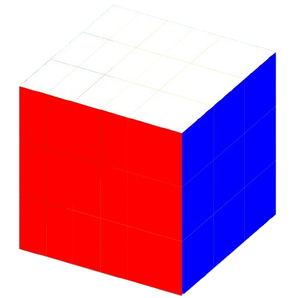

# Cubo Mágico (Rubik's Cube)

Um simulador simples e interativo de Cubo Mágico 3D construído com HTML, CSS e JavaScript. Este projeto demonstra o uso de matrizes de transformação para simular as rotações e animações do cubo, renderizadas com CSS.

Leia isso em outros idiomas: [EN](README.md), [PT-BR](README.pt-br.md)

**Experimente ao vivo em [GitHub Pages](https://noahstelmak.github.io/rubiks-cube/).**

## Funcionalidades

- **Cubo Interativo**: Rotacione e manipule um Cubo Mágico 3D diretamente no navegador.
- **Leve**: Desenvolvido com JavaScript puro, sem dependências externas.
- **Ferramenta Educacional**: Demonstra como transformações 3D funcionam no desenvolvimento web.

## Como Executar o Projeto

Como o projeto depende de JavaScript e CSS, ele precisa ser servido a partir de um servidor web.

## Melhorias Futuras

- **Renderização com WebGL**: Transição da renderização baseada em CSS para WebGL.
- **Algoritmos de Resolução**: Implementação de algoritmos conhecidos para resolver o Cubo Mágico.
- **Embaralhar**: Adicionar um botão para embaralhar o cubo aleatoriamente.
- **Funcionalidade de Desfazer/Refazer**: Suporte para desfazer e refazer movimentos, permitindo que os usuários experimentem e aprendam.
